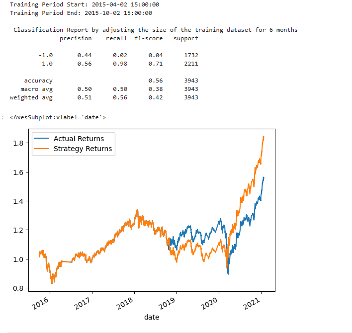
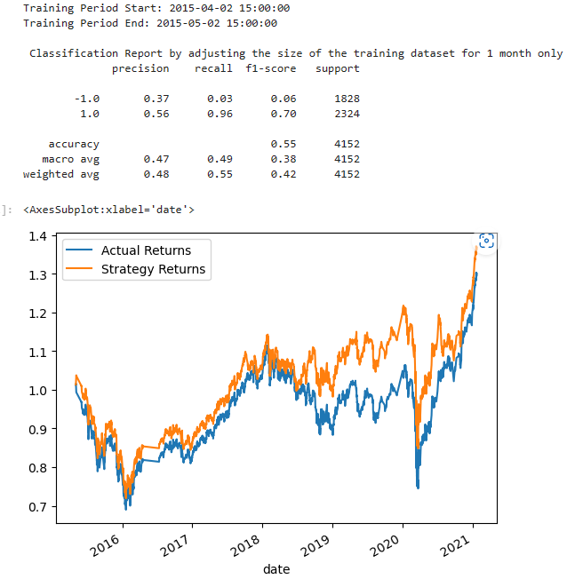

# Module-14-Challenge

## Background
As a financial advisor at one of the top five financial advisory firms in the world. Your firm constantly competes with the other major firms to manage and automatically trade assets in a highly dynamic environment. In recent years, your firm has heavily profited by using computer algorithms that can buy and sell faster than human traders.

The speed of these transactions gave your firm a competitive advantage early on. But, people still need to specifically program these systems, which limits their ability to adapt to new data. You’re thus planning to improve the existing algorithmic trading systems and maintain the firm’s competitive advantage in the market. To do so, you’ll enhance the existing trading signals with machine learning algorithms that can adapt to new data.

## Questions 
1. What impact resulted from increasing or decreasing the training window? By increasing the accuracy level went up by only 1% and the recall went up by 98%.

2. What impact resulted from increasing or decreasing either or both of the SMA windows?By increasing, the accuracy level increased by 56% and the recall level by 99%.

## Final Conclusions and analysis 
The AdaBoost Classifier model resulted in a significant increase in accuracy to 85%, which is much higher than the base model's 55% and the tuned model's 56%. However, the recall level decreased slightly to 0.92, compared to 0.95 for the base model and 0.99 for the tuned algorithm. Despite the slight decrease in recall, the AdaBoost model outperforms both the base and tuned algorithms, as it achieves high accuracy and a recall level of 0.92.